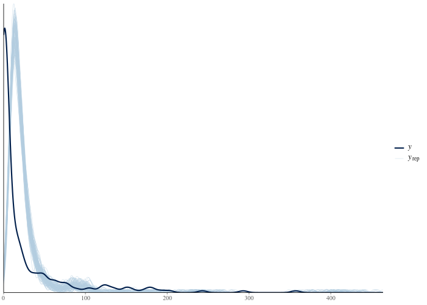
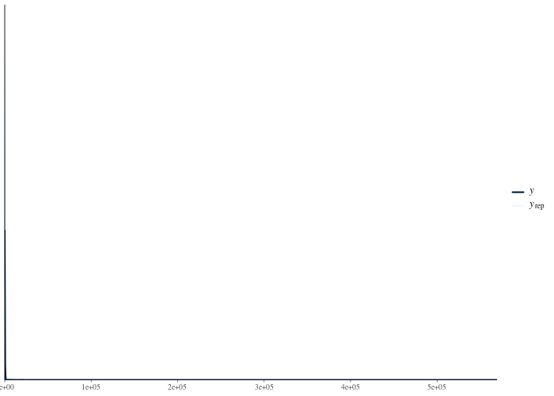

```{r, include = FALSE}
knitr::opts_chunk$set(
  collapse = TRUE,
  comment = "#>",
  eval = FALSE
)
```

<!-- The pasted output blocks below were captured from a real run via
     Rscript tools/precompute-vignettes.R case-study-roaches
     (sampler progress lines and repeated warnings trimmed).
     Regenerate and refresh the blocks when
     bayesgrove or CmdStan changes; outputs are version-dependent.
     Last refreshed against bayesgrove 0.7.0 / CmdStan 2.39.0. -->

The data come from a randomized trial of integrated pest management in urban
apartments (Gelman and Hill, 2007). For each of 262 apartments we have the
number of roaches caught in traps after the intervention (`y`), the
pre-treatment roach level (`roach1`), whether the apartment received the
treatment (`treatment`), whether the building is restricted to elderly
residents (`senior`), and the number of trap-days (`exposure2`). The question
is the trial's question: **does the pest-management treatment reduce roach
counts, and by how much?**

The chunks use `eval = FALSE` with output pasted from a real run, so the
vignette builds without CmdStan on CI. The dataset and three Stan programs
ship with the package.

## Setup

```{r setup}
library(bayesgrove)

handle <- bg_init(
  path = file.path(tempdir(), "bg-roaches"),
  project_name = "Roaches"
)
bg_use_workflow_packs(handle, "bayesgrove.default_bayesian")
bg_use_cmdstanr(handle)
```

```{r data}
roaches <- read.csv(
  system.file("extdata", "roaches.csv", package = "bayesgrove")
)
# Rescale the pre-treatment count so its coefficient is comparable in
# magnitude to the other predictors.
roaches$roach1s <- roaches$roach1 / 100

nrow(roaches)
mean(roaches$y == 0)
max(roaches$y)
```

```
[1] 262
[1] 0.3587786
[1] 357
```

Two features of the outcome deserve attention before any model is fit: more
than a third of the apartments caught *zero* roaches, and the largest count
is in the hundreds. Keep both in mind.

## Round 1: the Poisson model

The default first model for counts is Poisson regression with a log link and
the trap-days as an exposure offset. The package ships the program, so the
code runs as pasted:

```{r fit-poisson}
stan_data <- list(
  N = nrow(roaches),
  y = roaches$y,
  roach1s = roaches$roach1s,
  treatment = roaches$treatment,
  senior = roaches$senior,
  exposure2 = roaches$exposure2
)

n_pois <- bg_fit_stan(
  handle,
  stan_file = system.file(
    "stan/roaches_poisson.stan",
    package = "bayesgrove",
    mustWork = TRUE
  ),
  data = stan_data,
  label = "Poisson",
  seed = 707,
  chains = 4
)
```

```
Starting run "run_473d5bba" with 1 node to execute.
Running node "node_9c4bbb1f"...
Running node "node_6005a4f4"...
Running MCMC with 4 sequential chains...
All 4 chains finished successfully.
Mean chain execution time: 0.3 seconds.
Total execution time: 1.7 seconds.

<bg_run_handle> run_473d5bba
• Status: succeeded
• Executed Nodes: 2
```

The sampler is perfectly happy: no divergences, uniform R-hats, healthy
E-BFMI. The workflow pack agrees that nothing needs review yet:

```{r poisson-guidance}
bg_next_actions(handle)$obligations
```

```
named list()
```

This is the first lesson of the case study: **computational health is not
model adequacy.** Every sampler diagnostic is clean, and the model is about
to turn out to be unusable.

### The check that ends round 1

A `ppc` node computes posterior-predictive p-values for chosen test
statistics. For count data, `prop_zero` (the proportion of zeros) and the
dispersion-sensitive `sd` and `max` are the statistics that hurt:

```{r ppc-poisson}
graph <- bg_read_graph(handle)
n_data <- Filter(
  function(edge) identical(edge$to, n_pois),
  graph$edges
)[[1]]$from

n_ppc_pois <- bg_add_node(
  handle,
  kind = "ppc",
  label = "PPC: Poisson",
  inputs = c(n_pois, n_data),
  params = list(stats = c("mean", "sd", "prop_zero", "max"))
)
bg_run(handle, targets = n_ppc_pois)

ppc_pois <- Filter(
  function(s) identical(s$summary_kind, "posterior_predictive_check"),
  bg_read_summaries(handle, include_stale = FALSE)
)[[1]]
ppc_pois$severity
ppc_pois$metrics
```

```
Starting run "run_c7bb938d" with 1 node to execute.
Running node "node_82a6fcc2"...
<bg_run_handle> run_c7bb938d
• Status: succeeded
• Executed Nodes: 1
[1] "warning"
$max
[1] 0.9858

$mean
[1] 0.5025

$prop_zero
[1] 0

$sd
[1] 0
```

The p-values for `sd` and `prop_zero` are numerically zero: in four thousand
posterior-predictive draws, the Poisson model *never once* produced data as
dispersed as the real data, and never once produced as many zeros. The
observed data have a 36 percent zero rate; a Poisson model whose means are
anchored by apartments with hundreds of roaches essentially cannot generate
zeros at all. This is textbook overdispersion — the Poisson's variance is
pinned to its mean, and these counts have variance far beyond that.

A caveat that applies throughout: posterior-predictive p-values are
conservative tripwires, not calibrated tests. An extreme value is a loud
alarm, but an unremarkable value is weak evidence of adequacy — the primary
check is graphical:

```{r plot-poisson, fig.alt = "Posterior predictive density overlay for the Poisson model"}
bg_plot(handle, n_ppc_pois)
```



The observed density (dark) has a spike at zero and a long right tail. The
Poisson replicates (light) concentrate their mass in a narrow band and have
neither feature.

### The obligation and the recorded rejection

The failed check arrived as a warning-severity summary, so the default pack
now blocks forward progress with a review obligation demanding a recorded
judgment on the fresh evidence:

```{r obligation-poisson}
guide <- bg_next_actions(handle)
vapply(guide$obligations, `[[`, character(1), "kind")
vapply(guide$actions, `[[`, character(1), "kind")
```

```
                 obl_19245764 
"review_computation_validity" 
       act_5d3f5ca0        act_fba204ff 
  "record_decision" "branch_and_modify" 
```

The suggested actions are to record the criticism decision and to branch and
modify the fit — which is exactly the plan. First the decision. This is the
record a later reader (a reviewer, a co-author, yourself in a year) will
consult to understand why the analysis left the Poisson model:

```{r decision-poisson}
review <- Filter(
  function(a) identical(a$kind, "record_decision"),
  guide$actions
)[[1]]

bg_record_decision(
  handle,
  scope = "project",
  prompt = "Does the Poisson model reproduce the roach counts?",
  choice = "reject_poisson",
  rationale = paste(
    "The posterior predictive distribution cannot produce the observed",
    "dispersion (sd p-value 0) or the 36% zero rate (prop_zero p-value 0).",
    "The equidispersion assumption is untenable; move to a negative",
    "binomial count component."
  ),
  kind = review$payload$decision_type,
  metadata = review$payload[c("node_ids", "summary_ids")]
)
```

## Round 2: the negative binomial

The repair is a branch, not an edit: the Poisson fit and its failed check
stay in the record, and the branch documents its own reason for existing.
`bg_update_node()` merges params, so only the Stan program is swapped; data,
chains, and seed carry over.

```{r branch-nb}
nb <- bg_branch(handle, n_pois, label = "Negative binomial")

bg_set_goal(
  project = handle,
  branch_id = nb$branch_id,
  kind = "observable_prediction",
  label = "Treatment effect under overdispersion",
  rationale = paste(
    "The rejected Poisson fit motivates a count model with a",
    "free dispersion parameter."
  )
)

bg_update_node(
  handle,
  nb$root_node_id,
  params = list(
    stan_file = system.file(
      "stan/roaches_negbinomial.stan",
      package = "bayesgrove",
      mustWork = TRUE
    )
  )
)
bg_run(handle, targets = nb$root_node_id)
```

```
<bg_decision_record> dec_975400ae
• Prompt: Set inferential goal
• Choice: Treatment effect under overdispersion
• Rationale: The rejected Poisson fit motivates a count model with a free
  dispersion parameter.
[1] "node_361db0e2"
Starting run "run_3df77c4d" with 1 node to execute.
Running node "node_361db0e2"...
Running MCMC with 4 sequential chains...
All 4 chains finished successfully.
Mean chain execution time: 0.7 seconds.
Total execution time: 2.8 seconds.

<bg_run_handle> run_3df77c4d
• Status: succeeded
• Executed Nodes: 1
```

```{r ppc-nb}
n_ppc_nb <- bg_add_node(
  handle,
  kind = "ppc",
  label = "PPC: negative binomial",
  inputs = c(nb$root_node_id, n_data),
  params = list(stats = c("mean", "sd", "prop_zero", "max"))
)
bg_run(handle, targets = n_ppc_nb)

ppc_nb <- Filter(
  function(s) {
    identical(s$summary_kind, "posterior_predictive_check") &&
      identical(s$node_id, n_ppc_nb)
  },
  bg_read_summaries(handle, include_stale = FALSE)
)[[1]]
ppc_nb$severity
ppc_nb$metrics
```

```
Starting run "run_5e040ae6" with 1 node to execute.
Running node "node_67a0185c"...
<bg_run_handle> run_5e040ae6
• Status: succeeded
• Executed Nodes: 1
[1] "warning"
$max
[1] 0.994

$mean
[1] 0.9082

$prop_zero
[1] 0.3132

$sd
[1] 0.9835
```

Real model criticism is rarely a clean pass after one repair, and the
package does not pretend otherwise. The zero rate is now comfortably
reproduced (`prop_zero` around 0.3), but the `max` statistic has tripped in
the *opposite* direction: with the fitted dispersion (phi around 0.27), the
negative binomial's tail is so heavy that almost every replicate contains a
count *larger* than the observed maximum of 357. The model now overshoots
the extremes it previously could not reach.

```{r plot-nb, fig.alt = "Posterior predictive density overlay for the negative binomial model"}
bg_plot(handle, n_ppc_nb)
```



Is that disqualifying? This is precisely the judgment the workflow refuses
to make for you. A tripwire fired; a human must decide what it means *for
this question*. Our question is the average treatment effect, which is
driven by the bulk of the count distribution, not by whether the single
largest trap count is 357 or 3000. We record that judgment — visibly, with
its reasoning — rather than silently ignoring a warning:

```{r decision-nb}
nb_guide <- bg_next_actions(
  handle,
  scope = "branch",
  branch_id = nb$branch_id
)
review_nb <- Filter(
  function(a) identical(a$kind, "record_decision"),
  nb_guide$actions
)[[1]]

bg_record_decision(
  handle,
  scope = nb$branch_id,
  prompt = "Does the negative binomial model reproduce the roach counts?",
  choice = "accept_with_heavy_tail_caveat",
  rationale = paste(
    "Dispersion and zero rate are reproduced (prop_zero p = 0.31). The max",
    "statistic is extreme (p = 0.99): the NB tail overshoots the observed",
    "maximum. The estimand is the average treatment effect, which is not",
    "tail-driven, so the fit is retained; a zero-inflated variant will be",
    "fit as a competing candidate."
  ),
  kind = review_nb$payload$decision_type,
  metadata = review_nb$payload[c("node_ids", "summary_ids")]
)
```

## Round 3: a competing hypothesis about the zeros

The negative binomial explains the zeros as ordinary low-count outcomes. A
different mechanism is plausible: some apartments may have no roach
infestation at all, producing *structural* zeros regardless of exposure. A
zero-inflated negative binomial encodes that hypothesis. It is a genuinely
different model of the process, so it enters as a second branch from the
same criticized fit — not as a further edit of the NB branch:

```{r branch-zinb}
zinb <- bg_branch(handle, n_pois, label = "Zero-inflated NB")

bg_set_goal(
  project = handle,
  branch_id = zinb$branch_id,
  kind = "observable_prediction",
  label = "Treatment effect with structural zeros",
  rationale = "Competing hypothesis: a no-infestation mixture component."
)

bg_update_node(
  handle,
  zinb$root_node_id,
  params = list(
    stan_file = system.file(
      "stan/roaches_zinb.stan",
      package = "bayesgrove",
      mustWork = TRUE
    )
  )
)
bg_run(handle, targets = zinb$root_node_id)

n_ppc_zinb <- bg_add_node(
  handle,
  kind = "ppc",
  label = "PPC: zero-inflated NB",
  inputs = c(zinb$root_node_id, n_data),
  params = list(stats = c("mean", "sd", "prop_zero", "max"))
)
bg_run(handle, targets = n_ppc_zinb)

ppc_zinb <- Filter(
  function(s) {
    identical(s$summary_kind, "posterior_predictive_check") &&
      identical(s$node_id, n_ppc_zinb)
  },
  bg_read_summaries(handle, include_stale = FALSE)
)[[1]]
ppc_zinb$severity
ppc_zinb$metrics
```

```
<bg_decision_record> dec_463d2e97
• Prompt: Set inferential goal
• Choice: Treatment effect with structural zeros
• Rationale: Competing hypothesis: a no-infestation mixture component.
[1] "node_bc1a368c"
Starting run "run_350f796c" with 1 node to execute.
Running node "node_bc1a368c"...
Running MCMC with 4 sequential chains...
All 4 chains finished successfully.
Mean chain execution time: 1.4 seconds.
Total execution time: 6.1 seconds.

<bg_run_handle> run_350f796c
• Status: succeeded
• Executed Nodes: 1
Starting run "run_8b49968c" with 1 node to execute.
Running node "node_0a3fdf77"...
<bg_run_handle> run_8b49968c
• Status: succeeded
• Executed Nodes: 1
[1] "warning"
$max
[1] 0.9818

$mean
[1] 0.8422

$prop_zero
[1] 0.4145

$sd
[1] 0.9572
```

The picture is close to the plain negative binomial's: zeros comfortably
reproduced, the same heavy-tail caveat at the margin. The structural-zero
probability itself turns out to be small (about 7 percent on average), a
first hint that the zero-inflation machinery may not be earning its keep.
We record the branch's criticism decision with the same reasoning as before:

```{r decision-zinb}
zinb_guide <- bg_next_actions(
  handle,
  scope = "branch",
  branch_id = zinb$branch_id
)
review_zinb <- Filter(
  function(a) identical(a$kind, "record_decision"),
  zinb_guide$actions
)[[1]]

bg_record_decision(
  handle,
  scope = zinb$branch_id,
  prompt = "Does the zero-inflated NB model reproduce the roach counts?",
  choice = "accept_with_heavy_tail_caveat",
  rationale = paste(
    "Same predictive profile as the plain NB: zeros and dispersion",
    "reproduced, max statistic marginally extreme. Retained as a",
    "comparison candidate."
  ),
  kind = review_zinb$payload$decision_type,
  metadata = review_zinb$payload[c("node_ids", "summary_ids")]
)
```

## The enforced comparison

Every fit in the project now carries reviewed evidence, and the default pack
will not let the analysis conclude by fiat — project scope demands an
explicit comparison. Note who is in the candidate set: all three models,
*including* the rejected Poisson. A review decision covers evidence; it does
not quietly erase a model from the record. The comparison is where the
Poisson's inadequacy gets quantified, and the branch dispositions afterwards
are where candidates are formally accepted or rejected.

```{r comparison-obligation}
project_guide <- bg_next_actions(handle, scope = "project")
vapply(project_guide$obligations, `[[`, character(1), "kind")
```

```
                obl_d68109ce 
"compare_candidate_branches" 
```

The comparison is PSIS-LOO (Vehtari, Gelman, and Gabry, 2017), and it is
itself part of the graph: a `loo` node per candidate computes the
leave-one-out estimate from that fit's log-likelihood draws (emitting its
own Pareto-k diagnostic summary on the way), and a `compare` node consumes
all three:

```{r comparison-node}
n_loo_pois <- bg_add_node(
  handle,
  kind = "loo",
  label = "LOO: Poisson",
  inputs = n_pois
)
n_loo_nb <- bg_add_node(
  handle,
  kind = "loo",
  label = "LOO: negative binomial",
  inputs = nb$root_node_id
)
n_loo_zinb <- bg_add_node(
  handle,
  kind = "loo",
  label = "LOO: zero-inflated NB",
  inputs = zinb$root_node_id
)
n_compare <- bg_add_node(
  handle,
  kind = "compare",
  label = "Poisson vs NB vs ZINB",
  inputs = c(n_loo_pois, n_loo_nb, n_loo_zinb)
)
bg_run(handle, targets = n_compare)

print(bg_result(handle, n_compare))
```

```
Starting run "run_2f70c8ad" with 3 nodes to execute.
Running node "node_daa4f4b9"...
Running node "node_f41a3306"...
Running node "node_4c2b165d"...
Replacing NAs in `r_eff` with 1s
Running node "node_cd6c137c"...
<bg_run_handle> run_2f70c8ad
• Status: succeeded
• Executed Nodes: 4
$comparison_table
$comparison_table$model
[1] "node_f41a3306" "node_4c2b165d" "node_daa4f4b9"

$comparison_table$elpd_diff
[1]     0.0000000    -0.5972503 -5350.1325212

$comparison_table$se_diff
[1]   0.0000000   0.8328894 708.9827766
```

The table is ordered best-first, and the elpd values identify the rows: the
two count models sit at the top separated by a fraction of a standard error
(the negative binomial narrowly ahead, as the comparison decision below
records), and the Poisson sits at the bottom. Two things are on the record
now. First, the gulf: the Poisson is over five thousand elpd units below
the count models — the comparison does not merely rank it last, it
documents *how far* last. Second, the tie at the top between the negative
binomial and its zero-inflated extension.

### The diagnostics of the diagnostics

The loo nodes emitted their own evidence, and it does not all pass: the
Poisson's importance sampling is unreliable (many high Pareto-k values, the
expected signature of a badly misspecified model), and the ZINB has one
borderline observation. Unreviewed warnings block progress here exactly as
they did for the fits, so the workflow demands a judgment on the reliability
of its own comparison evidence before it lets the comparison conclude:

```{r loo-review}
project_guide <- bg_next_actions(handle, scope = "project")
loo_review <- Filter(
  function(a) {
    identical(a$kind, "record_decision") &&
      !identical(a$payload$decision_type, "model_comparison")
  },
  project_guide$actions
)[[1]]

bg_record_decision(
  handle,
  scope = "project",
  prompt = "Are the PSIS-LOO estimates reliable enough to compare on?",
  choice = "accept_loo_evidence",
  rationale = paste(
    "The Poisson's high Pareto-k values are the expected signature of",
    "gross misspecification; no plausible correction moves it thousands",
    "of elpd units. The single borderline k in the ZINB cannot overturn",
    "a sub-SE difference against the NB. The comparison verdict does not",
    "depend on PSIS precision here."
  ),
  kind = loo_review$payload$decision_type,
  metadata = loo_review$payload[c("node_ids", "summary_ids")]
)
```

Decisions are scope-specific, and the loo evidence for the branch fits
lives on those branches: the project-scope decision above does not cover
them. Each branch records the same judgment for its own evidence — the
repetition is the point, since each active line of analysis must answer for
what it relies on:

```{r loo-review-branches}
for (b in list(nb, zinb)) {
  b_guide <- bg_next_actions(handle, scope = "branch", branch_id = b$branch_id)
  b_reviews <- Filter(
    function(a) {
      identical(a$kind, "record_decision") &&
        !identical(a$payload$decision_type, "branch_disposition")
    },
    b_guide$actions
  )
  for (b_review in b_reviews) {
    bg_record_decision(
      handle,
      scope = b$branch_id,
      prompt = "Are the PSIS-LOO estimates reliable enough to compare on?",
      choice = "accept_loo_evidence",
      rationale = paste(
        "Same judgment as the project-scope review: the Pareto-k pattern",
        "cannot overturn either the gulf to the Poisson or the sub-SE",
        "tie between the count models."
      ),
      kind = b_review$payload$decision_type,
      metadata = b_review$payload[c("node_ids", "summary_ids")]
    )
  }
}
```

Ties are informative. The zero-inflation component adds a parameter and a
mechanism the data do not demand — the plain negative binomial already
produces enough zeros. Following the parsimony principle, the comparison
decision prefers the negative binomial, and says so in the log:

```{r comparison-decision}
project_guide <- bg_next_actions(handle, scope = "project")
comparison_action <- Filter(
  function(a) {
    identical(a$kind, "record_decision") &&
      identical(a$payload$decision_type, "model_comparison")
  },
  project_guide$actions
)[[1]]

bg_record_decision(
  handle,
  scope = "project",
  prompt = "Which candidate model should carry the treatment inference?",
  choice = "prefer_negative_binomial",
  rationale = paste(
    "LOO cannot distinguish the candidates (elpd difference well within",
    "one SE). The ZINB's structural-zero probability is small (~7%) and",
    "its extra machinery buys no predictive improvement. Prefer the",
    "simpler negative binomial."
  ),
  kind = "model_comparison",
  metadata = comparison_action$payload[c(
    "fit_node_ids",
    "summary_ids",
    "candidate_signature",
    "comparison_signature",
    "comparison_context"
  )]
)
```

With a comparison on record, each branch must be explicitly closed out —
accepted or rejected, with reasons:

```{r dispositions}
for (b in list(
  list(branch = nb, disposition = "accept", why = paste(
    "Preferred by the comparison decision: equivalent predictive",
    "performance with fewer moving parts."
  )),
  list(branch = zinb, disposition = "reject", why = paste(
    "No predictive gain over the plain NB and a near-zero mixture",
    "weight; rejected in favor of the simpler candidate."
  ))
)) {
  b_guide <- bg_next_actions(
    handle,
    scope = "branch",
    branch_id = b$branch$branch_id
  )
  d_action <- Filter(
    function(a) {
      identical(a$kind, "record_decision") &&
        identical(a$payload$decision_type, "branch_disposition")
    },
    b_guide$actions
  )[[1]]

  bg_record_decision(
    handle,
    scope = b$branch$branch_id,
    prompt = "Accept or reject this branch?",
    choice = b$disposition,
    rationale = b$why,
    kind = "branch_disposition",
    metadata = list(
      disposition = b$disposition,
      summary_ids = d_action$payload$summary_ids,
      comparison_signature = d_action$payload$comparison_signature,
      comparison_context = d_action$payload$comparison_context
    )
  )
}

bg_next_actions(handle, scope = "project")$obligations
bg_next_actions(handle, scope = "branch", branch_id = nb$branch_id)$obligations
bg_next_actions(handle, scope = "branch", branch_id = zinb$branch_id)$obligations
```

```
named list()
named list()
named list()
```

No outstanding obligations at any scope: every piece of evidence the
workflow collected has a recorded judgment attached.

## What the enforced loop changed

The treatment effect, as a multiplicative factor on the
roach count (posterior median and 90 percent interval of
`exp(b_treatment)`):

| Model | Effect | 90% interval |
|:------|:------:|:------------:|
| Poisson (rejected at review) | 0.60 | [0.57, 0.62] |
| Negative binomial (accepted) | 0.46 | [0.31, 0.69] |

The Poisson fit estimates a 40 percent reduction. The accepted negative
binomial fit estimates a larger reduction, with an interval roughly five
times wider. The failed predictive check raised a blocking obligation, and
the decision log records why the Poisson model was rejected.

```{r effect-check}
draws <- bg_result(handle, nb$root_node_id)$draws("b_treatment")
round(quantile(exp(draws), c(0.05, 0.5, 0.95)), 2)
```

```
  5%  50%  95% 
0.31 0.46 0.69 
```

## The audit trail

The graph holds all three models, their checks, and the comparison; the
decision log holds every judgment that steered the analysis — the goals,
the reviews, the comparison, and the dispositions:

```{r trail}
print(bg_read_graph(handle))

for (d in bg_read_decisions(handle)) {
  cat(d$kind, "-", d$choice, "\n")
}
```

```

── Execution Graph ──

└── Poisson_data <stan_data> [new]
    ├── Poisson <cmdstanr_fit> [new]
    │   ├── PPC: Poisson <ppc> [new]
    │   └── LOO: Poisson <loo> [new]
    │       └── Poisson vs NB vs ZINB <compare> [new]
    ├── [already shown: PPC: Poisson]
    ├── Negative binomial <cmdstanr_fit> [new]
    │   ├── PPC: negative binomial <ppc> [new]
    │   └── LOO: negative binomial <loo> [new]
    │       └── [already shown: Poisson vs NB vs ZINB]
    ├── [already shown: PPC: negative binomial]
    ├── Zero-inflated NB <cmdstanr_fit> [new]
    │   ├── PPC: zero-inflated NB <ppc> [new]
    │   └── LOO: zero-inflated NB <loo> [new]
    │       └── [already shown: Poisson vs NB vs ZINB]
    └── [already shown: PPC: zero-inflated NB]
computation_review - reject_poisson 
goal_update - Treatment effect under overdispersion 
computation_review - accept_with_heavy_tail_caveat 
goal_update - Treatment effect with structural zeros 
computation_review - accept_with_heavy_tail_caveat 
computation_review - accept_loo_evidence 
computation_review - accept_loo_evidence 
computation_review - accept_loo_evidence 
model_comparison - prefer_negative_binomial 
branch_disposition - accept 
branch_disposition - reject 
```

`bg_export_report()` renders the whole trail into a document — every fit,
every diagnostic summary, every decision with its rationale, and the branch
lineage:

```{r report}
bg_export_report(
  handle,
  format = "md",
  path = file.path(tempdir(), "roaches-report.md")
)
```

An excerpt of the decision trail as it appears in the report:

```
## Decision Provenance
### Does the Poisson model reproduce the roach counts?
- **Choice:** reject_poisson
- **Rationale:** The posterior predictive distribution cannot produce the observed dispersion (sd p-value 0) or the 36% zero rate (prop_zero p-value 0). The equidispersion assumption is untenable; move to a negative binomial count component.
- **Scope:** project
- **Timestamp:** 2026-07-11T06:36:36Z

### Set inferential goal
- **Choice:** Treatment effect under overdispersion
- **Rationale:** The rejected Poisson fit motivates a count model with a free dispersion parameter.
- **Scope:** branch:39cc17ab
- **Timestamp:** 2026-07-11T06:36:36Z

### Does the negative binomial model reproduce the roach counts?
- **Choice:** accept_with_heavy_tail_caveat
```

For what to archive alongside a manuscript and what a reviewer can verify
from the archive without re-running anything, see the reproducible-research
article on the package site.

## References

- Gelman, A., and Hill, J. (2007). *Data Analysis Using Regression and
  Multilevel/Hierarchical Models*. Cambridge University Press. (The roaches
  data ship with the package; the copy is taken from the ROS-Examples
  repository, <https://github.com/avehtari/ROS-Examples>.)
- Gelman, A., Hill, J., and Vehtari, A. (2020). *Regression and Other
  Stories*. Cambridge University Press.
- Vehtari, A., Gelman, A., and Gabry, J. (2017). Practical Bayesian model
  evaluation using leave-one-out cross-validation and WAIC. *Statistics and
  Computing*, 27(5), 1413-1432.
