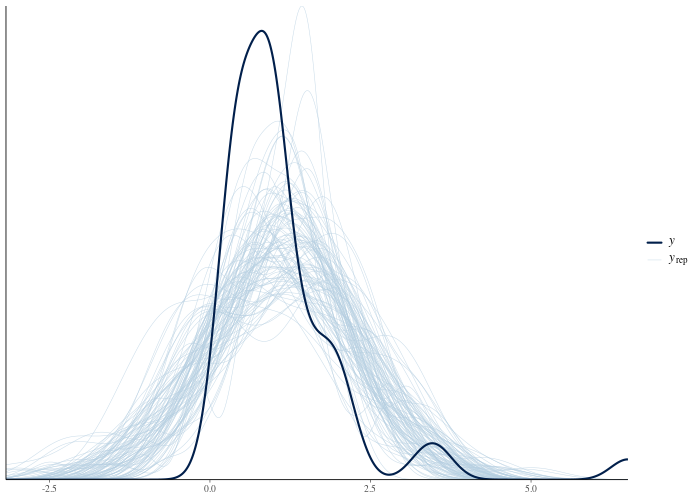

```{r, include = FALSE}
knitr::opts_chunk$set(
  collapse = TRUE,
  comment = "#>",
  eval = FALSE
)
```

<!-- The pasted output blocks below were captured from a real run via
     Rscript tools/precompute-vignettes.R getting-started
     (sampler progress lines and repeated warnings trimmed).
     Regenerate and refresh the blocks when bayesgrove or
     CmdStan changes; outputs are version-dependent.
     Last refreshed against bayesgrove 0.7.0 / CmdStan 2.39.0. -->

Fit a normal model to positive, skewed data, inspect its predictive checks,
then record a review and try a lognormal model. This tutorial requires
cmdstanr and CmdStan. The displayed results come from a recorded run; your
sampler output may differ. See [Concepts](concepts.html) for terminology.

## Create a project and fit a model

An initialized project is a directory with a `.bayesgrove/` folder containing
the graph, cache, and decision log.
`bg_use_cmdstanr()` registers the Stan-backed node kinds, and
`bg_use_default_workflow()` opts into the built-in review pack (register
the backend first, so the pack sees the real node kinds rather than its
generic placeholders).

```{r setup}
library(bayesgrove)

handle <- bg_init(
  path = file.path(tempdir(), "bg-getting-started"),
  project_name = "Getting Started"
)
bg_use_cmdstanr(handle)
bg_use_default_workflow(handle)
```

The data are 50 skewed, strictly positive measurements. Start by fitting a
normal model.

```{r data}
set.seed(31)
y <- round(rlnorm(50, meanlog = 0, sdlog = 0.8), 3)
```

`bg_fit_stan()` creates a data node, attaches the data, and creates and runs
a fit node that uses it. The example Stan programs are included in the package.

```{r fit}
normal_program <- system.file(
  "stan/normal_iid.stan",
  package = "bayesgrove",
  mustWork = TRUE
)

n_fit <- bg_fit_stan(
  handle,
  stan_file = normal_program,
  data = list(N = length(y), y = y),
  label = "Normal model",
  seed = 21,
  chains = 4
)
```

```
#> Starting run "run_dfbdc04b" with 1 node to execute.
#> Running node "node_66f87a33"...
#> Running node "node_7bd2286f"...
#> <bg_run_handle> run_dfbdc04b
#> • Status: succeeded
#> • Executed Nodes: 2
```

The fit has no divergences and good R-hats. `bg_status()` shows the
project state, and `bg_next_actions()` asks the workflow pack whether any
evidence needs review:

```{r first-guidance}
bg_status(handle)
```

```
#> $workflow_state
#> [1] "idle"
#>
#> $runnable_nodes
#> [1] 0
#>
#> $blocked_nodes
#> [1] 0
#>
#> $pending_gates
#> [1] 0
#>
#> $active_jobs
#> [1] 0
#>
#> $last_run_id
#> [1] "run_dfbdc04b"
#>
#> $health
#> [1] "ok"
#>
#> $messages
#> character(0)
```

```{r first-obligations}
guide <- bg_next_actions(handle)
guide$obligations
```

```
#> named list()
```

There are no obligations: the only summary is the fit's HMC diagnostic,
which reports no problems. The pack requests no further review of that summary.

## Check the model's predictions

Sampler diagnostics assess computation, not model fit. The built-in `ppc`
node kind computes posterior-predictive p-values
for a set of test statistics and stores plot-ready draws. It takes two
inputs: the fit (for the `yrep` draws) and the data node (for the observed
`y`). The fit's data node is simply the fit node's input, so we can read it
off the graph:

```{r ppc}
graph <- bg_read_graph(handle)
n_data <- Filter(
  function(edge) identical(edge$to, n_fit),
  graph$edges
)[[1]]$from

n_ppc <- bg_add_node(
  handle,
  kind = "ppc",
  label = "PPC: normal model",
  inputs = c(n_fit, n_data),
  params = list(stats = c("mean", "sd", "min", "max"))
)
run <- bg_run(handle, targets = n_ppc)
```

```
#> Starting run "run_631ca2d5" with 1 node to execute.
#> Running node "node_7ea22ed9"...
```

The p-values compare each statistic of the observed data against its
posterior-predictive distribution. Values near 0 or 1 flag features that the
model reproduces poorly:

```{r ppc-summary}
ppc_summary <- bg_read_summaries(handle, include_stale = FALSE)
ppc_summary <- Filter(
  function(s) identical(s$summary_kind, "posterior_predictive_check"),
  ppc_summary
)[[1]]
ppc_summary$severity
ppc_summary$metrics
```

```
#> [1] "warning"
#> $max
#> [1] 2e-04
#>
#> $mean
#> [1] 0.5098
#>
#> $min
#> [1] 2e-04
#>
#> $sd
#> [1] 0.5025
```

The model predicts negative values absent from the data (`min`) and fails
to reproduce the largest observations (`max`). The `mean` and `sd` checks
do not flag these problems. Posterior-predictive p-values are conservative;
an unremarkable value is weak evidence of fit. Inspect the predictive plot:

```{r ppc-plot, fig.alt = "Posterior predictive density overlay for the normal model"}
bg_plot(handle, n_ppc)
```



## Record a review

The summary has `warning` severity because of the extreme p-values. The
default pack raises a blocking `review_computation_validity` obligation at
project scope. Optional packs use more specific obligation kinds:

```{r obligation}
guide <- bg_next_actions(handle)
vapply(guide$obligations, `[[`, character(1), "kind")
vapply(guide$actions, `[[`, character(1), "kind")
```

```
#>                  obl_a969dc96
#> "review_computation_validity"
#>        act_16593cd9        act_ed08cddc
#>   "record_decision" "branch_and_modify"
```

An obligation identifies work needed to address the evidence and suggests
actions to resolve it. Blocking obligations create execution holds. Pass
these holds to the planner to prevent downstream nodes from running until
the review is recorded.

```{r holds}
held_plan <- bg_plan(handle, external_holds = guide$metadata$external_holds)
held_plan$external_blocked
```

```
#> list()
```

The list is empty because the failing check has no downstream nodes yet.
A dependent node would be held until the obligation is resolved.

To resolve the obligation we record a decision. A decision is a permanent
log entry: the prompt, the choice, the rationale, and the ids of the
evidence it covers. The suggested `record_decision` action carries the right
metadata in its payload, so we do not have to assemble it by hand:

```{r decision}
review <- Filter(
  function(a) identical(a$kind, "record_decision"),
  guide$actions
)[[1]]

bg_record_decision(
  handle,
  scope = "project",
  prompt = "Does the normal model reproduce the data?",
  choice = "reject_normal_model",
  rationale = paste(
    "The observed minimum is far outside the posterior predictive",
    "distribution: the data are strictly positive and right-skewed,",
    "and a normal model cannot express that. Refit on the log scale."
  ),
  kind = review$payload$decision_type,
  metadata = review$payload[c("node_ids", "summary_ids")]
)

bg_next_actions(handle)$obligations
```

```
#> <bg_decision_record> dec_632c0a7b
#> • Prompt: Does the normal model reproduce the data?
#> • Choice: reject_normal_model
#> • Rationale: The observed minimum is far outside the posterior predictive
#>   distribution: the data are strictly positive and right-skewed, and a normal
#>   model cannot express that. Refit on the log scale.
#> named list()
```

The recorded review resolves the obligation. The summary and decision
remain available so a reviewer can trace the rejection to its evidence.

## Fit a lognormal model on a branch

Try the lognormal model on a branch to keep the rejected fit and its
criticism in the record. `bg_branch()` copies the
fit node into a new branch; `bg_update_node()` merges params, so only the
Stan program changes. The default pack requires an inferential goal for each
active branch. The goal records what the branch is intended to estimate.

```{r branch}
branch <- bg_branch(handle, n_fit, label = "Lognormal model")

bg_set_goal(
  project = handle,
  branch_id = branch$branch_id,
  kind = "observable_prediction",
  label = "Positive-valued predictions",
  rationale = "The rejected normal fit motivates a lognormal likelihood."
)

lognormal_program <- system.file(
  "stan/lognormal_iid.stan",
  package = "bayesgrove",
  mustWork = TRUE
)

bg_update_node(
  handle,
  branch$root_node_id,
  params = list(stan_file = lognormal_program)
)
run2 <- bg_run(handle, targets = branch$root_node_id)
```

```
#> <bg_decision_record> dec_ca79d9cb
#> • Prompt: Set inferential goal
#> • Choice: Positive-valued predictions
#> • Rationale: The rejected normal fit motivates a lognormal likelihood.
#> [1] "node_4610511f"
#> Starting run "run_f3475fdc" with 1 node to execute.
#> Running node "node_4610511f"...
```

A second `ppc` node checks the lognormal model's predictions:

```{r branch-ppc}
n_ppc2 <- bg_add_node(
  handle,
  kind = "ppc",
  label = "PPC: lognormal model",
  inputs = c(branch$root_node_id, n_data),
  params = list(stats = c("mean", "sd", "min", "max"))
)
bg_run(handle, targets = n_ppc2)

ppc2 <- Filter(
  function(s) {
    identical(s$summary_kind, "posterior_predictive_check") &&
      identical(s$node_id, n_ppc2)
  },
  bg_read_summaries(handle, include_stale = FALSE)
)[[1]]
ppc2$severity
ppc2$metrics
```

```
#> Starting run "run_cc95c582" with 1 node to execute.
#> Running node "node_70de7bc7"...
#> <bg_run_handle> run_cc95c582
#> • Status: succeeded
#> • Executed Nodes: 1
#> [1] "ok"
#> $max
#> [1] 0.2
#>
#> $mean
#> [1] 0.4708
#>
#> $min
#> [1] 0.6925
#>
#> $sd
#> [1] 0.3262
```

Both models remain in the graph: the rejected normal fit with its failed
check and recorded rejection, and the lognormal fit whose check passed:

```{r graph}
print(bg_read_graph(handle))
```

```
#> ── Execution Graph ──
#>
#> └── Normal model_data <stan_data> [new]
#>     ├── Normal model <cmdstanr_fit> [new]
#>     │   └── PPC: normal model <ppc> [new]
#>     ├── [already shown: PPC: normal model]
#>     ├── Lognormal model <cmdstanr_fit> [new]
#>     │   └── PPC: lognormal model <ppc> [new]
#>     └── [already shown: PPC: lognormal model]
```

## Continue the analysis

- [Eight schools](eight-schools.html) shows how to review sampler diagnostics
  and reparameterize a model.
- The [roaches case study](case-study-roaches.html) compares competing models
  and records which branches to accept.
- [Reproducible research](reproducible-research.html) covers reports and
  project bundles.

For gates, scopes, and evidence freshness, see [Concepts](concepts.html).
For additional workflow packs and custom executors, see
[Extensions](extensions.html). Use `bg_repl(handle)` to inspect reviews and
execute suggested actions interactively.
